# maze-game

算法设计与分析课设代码

本项目需要依赖 OpenCV 环境

## 目的与要求

猪八戒与唐僧身处一个 m×n 的迷宫中，如图所示。每一个方格表示迷宫中的一个房间。这 m×n 个房间中有一些房间里面有妖精居住，不允许进入。在迷宫中任何房间均可沿 8 个方向进入相邻的安全房间。猪八戒位于迷宫的(p，q)方格中，他必须找出一条通向唐僧所在的(t，s)方格的路。请设计和实现一个算法帮助猪八戒找出这样一条道路。

程序的主界面如下：

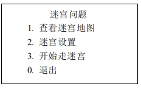

扩展要求

（1）求最短的路径

（2）每改变一次前进方向算作转弯一次，求转弯次数最少的路径

（3）要求猪八戒在抵达唐僧之前，必须走遍所有住有妖精的房间各一次，铲除妖精后，再找到唐僧。

提示

考虑迷宫的数据结构

考虑路径搜索算法的策略

## 玩法说明

键盘按下 q w e a d z x c 可沿着 8 个方向移动，p 开始路径规划，l 开始自动导航，

u,i 切换是否击杀妖怪模式，o 击杀所有妖怪并解救唐僧，鼠标左键添加障碍物，鼠标右键清除障碍物，鼠标中键添加妖怪，ctrl+鼠标中键可导航到任意地点。

数字键 1 切换 A\*路径规划器

数字键 2 切换 DFS 路径规划器

数字键 3 切换 BFS 路径规划器

## 技术说明

### 地图生成器

MapGenerator 类实现了所有地图生成器的一个基类，其构造函数需要传入一张空白的 MarkMap，起点，终点信息。

其中存在一个纯虚函数 generate 方法，该方法用于地图的生成，交给派生自 MapGenerator 类的子类实现。

目前仅实现了 DFS 迷宫生成算法，但搭建了符合**开闭原则**的迷宫生成框架，例如后期可继承 MapGenerator 基类实现 Prim 算法

#### DFS 迷宫生成

DfsMapGenerator 类继承自 MapGenerator 类，实现了通过 DFS 算法生成迷宫的算法，该算法实现良好。

#### 随机 Prim 迷宫生成

PrimMapGenerator 类继承自 MapGenerator 类，该类预计实现随机 Prim 算法生成迷宫，该算法**暂未实现**。

### 路径规划

#### 路径(Path)

首先，我们需要引入路径的数据结构，一条路径是一个由起点到终点的所有顶点构成的一组有序的点集。

Path 类定义了路径的数据结构，为一个顶点链表，该类包含了一些常用方法，如计算该路径的各个位移段，计算转弯次数，计算路径长度(路径长度规定水平竖直为 2，斜方向为 3)。

#### 路径规划器(RoutePlanner)

RoutePlanner 类为一个抽象类，其中构造函数传入路径规划所需的障碍地图，存在一个纯虚函数 Path plan(const Point &start,const Point &end)用于交给子类实现其中的路径规划算法。

实现了 DFS/BFS/A\*寻路算法，并通过**策略模式**实现运行时动态切换算法

具体算法详情可参考**课程设计报告**

### 地图

地图实际上是一个二维数组，具体实现参考代码"map/Map.hpp"中定义的 Map 类。

它底层使用动态开辟的一维数组，通过面向对象封装，隐藏了底层数据结构，对上层只提供二维的访问方式，实现了动态创建二维数组。并且提供了一些便捷的批量操作方法。

该类使用需要传入一个模板参数，表示二维数组的元素类型。后续的标记地图类便派生于此类。

### 标记地图

标记地图为本课设提出的一个概念，它实际上是继承自 Map 类，模板参数为 bool 的一个派生类。

它用于标记一副指定尺寸的地图，能够进行标记，清除，判定等操作。

实际上，障碍物地图(ObstacleMap)，妖怪地图(MonsterMap)，均为 MarkMap 换了一个名字。

### 多层融合标记地图

由于本项目课设中的基础功能需要将妖怪看做障碍物，避开妖怪行进，而扩展功能中又要求击杀所有的妖怪，故提出多层标记地图的概念通过 C++的动态多态性实现路径规划所需地图的动态切换，大大地提高了项目的灵活性。

MultiMarkMap 继承自 MarkMap，重写了 hasMark 方法，添加了 addMarkMap(MarkMap \*markMap)方法，实现了逻辑上的地图融合。

addMarkMap 方法的实现非常简单，就是将另一个 MarkMap 的指针放入一个链表即可。

地图的分层技术使用了**组合模式**，当把妖怪考虑为障碍物时，不必修改真正障碍物地图的数据，实现了单一职责原则，也不必改动寻路算法的逻辑，摆脱了控制耦合。

### 多级菜单

游戏中多级菜单的实现使用了有限状态机的思想

本程序的菜单模块位于 util/Menu.hpp 中，这是一个基于确定型有穷自动机理论的一个菜单的实现，可轻易地实现 n 级复杂菜单，以及动态菜单的创建与显示。

在游戏的开局菜单中，使用到了如下菜单定义，本菜单模块用法极其简单，只需要构造时传入菜单名，添加菜单项，启动菜单循环三步即可在控制台实现菜单输出。

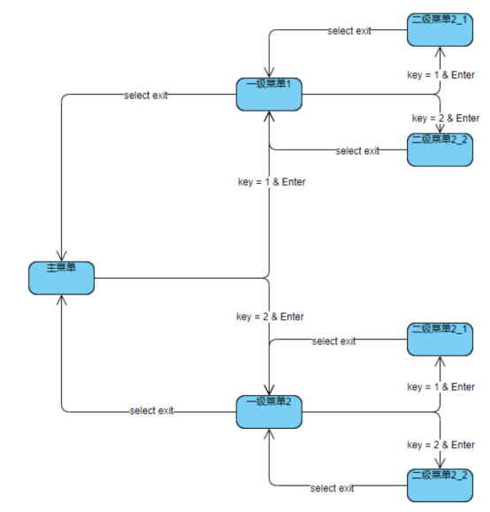

### GUI 实现

GUI 的实现全程使用了 OpenCV 的 cv::imshow 显示图片来渲染最终的显示，由于对 opencv 的 api 调用不熟，故很多绘图逻辑的实现相当暴力。

## 游戏运行截图

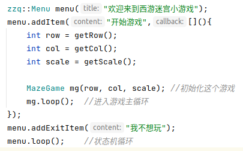

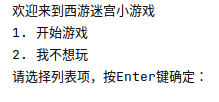

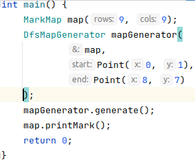

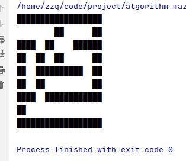

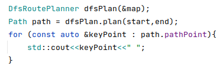

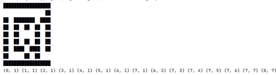

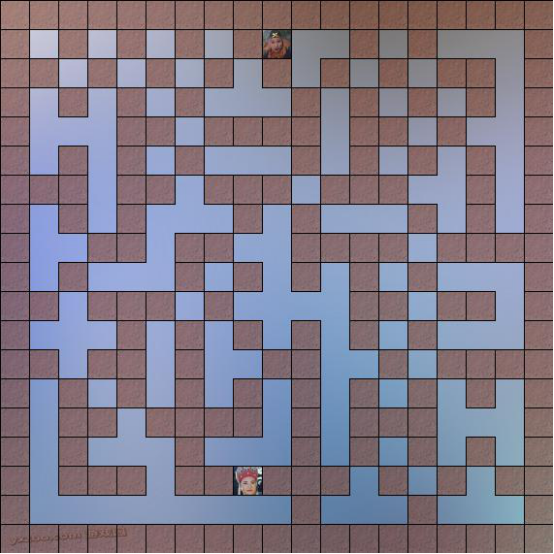

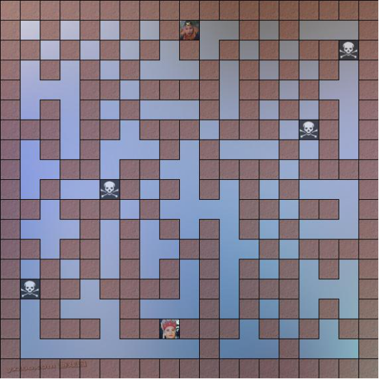

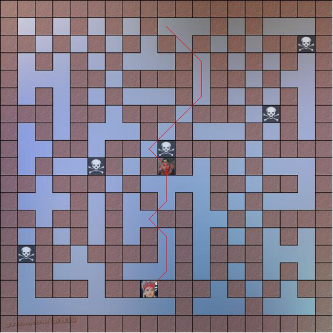

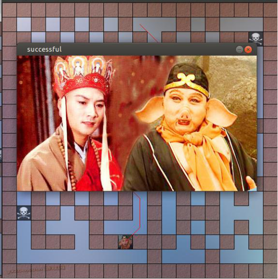

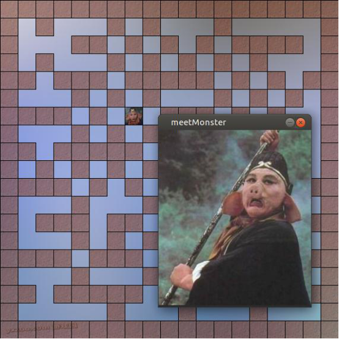

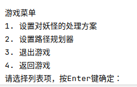

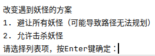

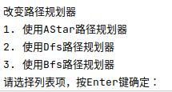
